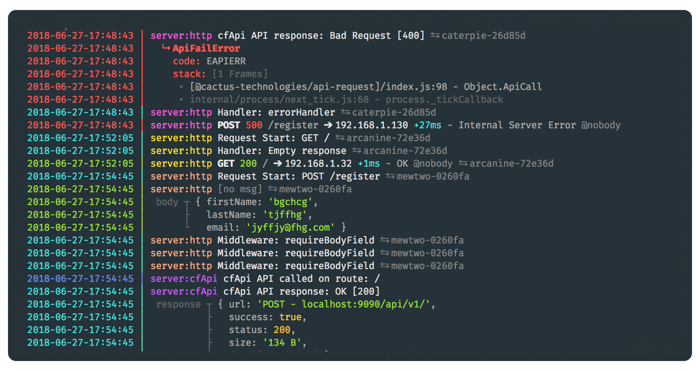

# @mechanicalhuman/bunyan-pretty


> Prettifies NDJSON (Newline Delimited JSON) logs, like \`bunyan -o short\` but actually pretty.

---

## Table of Contents

- [Installation](#installation)

- [Usage](#usage)

  - [Advanced Usage](#advanced-usage)

- [Programatic Interface](#programatic-interface)

- [Options](#options)

- [Example](#example)

- [Changelog](#changelog)

- [Maintainers](#maintainers)

- [License](#license)

## Installation

```sh
npm install @mechanicalhuman/bunyan-pretty
```

## Usage

The tool reads from the `STDIN` and is installed as the cmd `pretty` in the shell.

- You can pipe it to the output of a running application:

  ```sh
  node index.js | pretty [OPTIONS]
  ```

- Or just feed it an already existing file.

  ```sh
  pretty [OPTIONS] < input.log
  ```

### Advanced Usage

```txt
    pretty --help
    ___

    Usage: ... | pretty [options]

    Time Stamps
    --time-stamps                   Print TimeStamps.                   [boolean][default: true]
    --stamps-format, -f             TimeStamps format.                  [YYYY-MM-DD-HH:mm:ss]
    --stamps-time-zone, --tz        TimeStamps zone offset.             [default: "Etc/UTC"]
    --print-host                    Prepends the host to the log line.  [boolean][default: false]

    Filter
    --strict                        Only show "legal" log lines.        [boolean][default: false]
    --level, -l                     Only show messages >= level.        [string][default: "trace"]

    Inspect
    --depth                         (passed to util.inspect)            [number][default: 4]
    --max-array-length              (passed to util.inspect)            [number][default: 100]

    Other
    --force-color                   Force color output                  [boolean][default: false]
```



Notes:

- The`boolean` options can be set false using `--no-option`. Example: `--no-time-stamps`
- The`--level` choices are: "trace", "debug", "info", "error", "warn", "fatal"
- The`--stamps-format` value is passed directly to [`moment.format()`](https://momentjs.com/docs/#/displaying/format/)
- You force the colored output using the env variable: `FORCE_COLOR=1`
- You can pass the time stamps zone offset via the env variable: `PRETTY_TZ`
- You can pass the time stamps format via the env variable: `PRETTY_STAMPS_FORMAT`

## Programatic Interface

You can use pretty as a writable stream from inside your NodeJS scripts. Probably usefull on development.

```js
/**
 * WIll wrap the given stream with pretty.
 *
 * @param  {WritableStream} stream          Writable stream to wrap pretty around
 * @param  {Object} [opts]                  Options object, will merge with the default options.
 *
 * @return {WritableStream}
 */

const pretty = require('@mechanicalhuman/bunyan-pretty')
```

## Options

The options object passed to `pretty` will merge with the default options.

```js
const defaultOptions = {
  level: 'trace', // Only print messages >= level.
  strict: false, // Only print valid pino/bunyan logs

  colorize: chalk.supportsColor !== false,

  depth: 4, // (passed to util.inspect)
  maxArrayLength: 100, // (passed to util.inspect)

  printHost: false, // Print Host.
  timeStamps: true, // Print TimeStamps.
  stampsFormat: 'YYYY-MM-DD-HH:mm:ss',
  stampsTimeZone: moment.tz.guess() // TimeStamps zone offset (Based on your Locale)
}
```

## Example

```js
const pretty = require('@mechanicalhuman/bunyan-pretty')
const bunyan = require('bunyan')

const log = bunyan.createLogger({
  name: 'app',
  stream: pretty(process.stdout, { timeStamps: false }),
  level: 'info'
})

log.info('hello world')
```

## Changelog

Find the CHANGELOG [here](CHANGELOG.md), generated using Conventional Commits.

## Maintainers

- [Jorge Proaño](mailto:jorge@hiddennodeproblem.com)

## License

[MIT](LICENSE) © [Jorge Proaño](http://www.hidden-node-problem.com)
